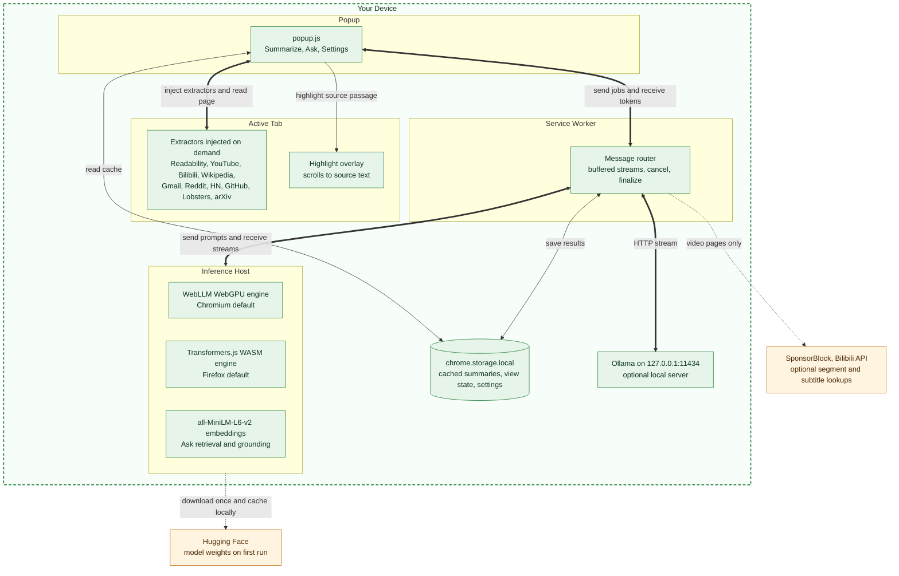
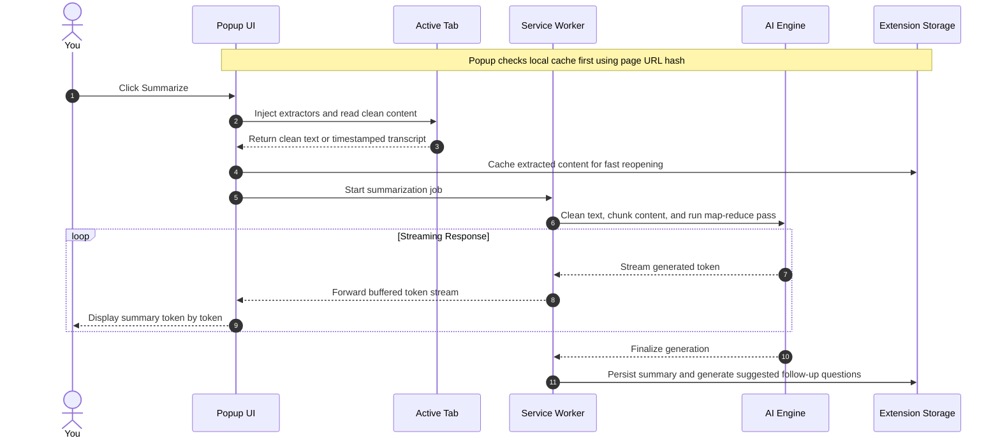

# Apogee Architecture

Apogee is an offline-first browser extension designed for complete data privacy. Every piece of text analysis, summarization, and question answering runs on your local machine using in-browser AI engines or a local Ollama server.

## Overview

Apogee operates through four cooperating execution contexts that communicate using standard WebExtension messaging.

- **Popup UI**: The user interface for triggering summaries, selecting output formats, asking follow-up questions, and searching past summaries.
- **Service Worker**: The central router that coordinates tasks, buffers streaming tokens, manages background alarms, and persists results to local storage.
- **Inference Host**: The environment where AI models execute. On Chromium browsers, this is a dedicated offscreen document supporting WebGPU and WebAssembly. On Firefox, model execution runs inside the background page.
- **Content Extractors**: Specialized scripts injected into active browser tabs to clean page content, parse transcripts, process structured data, or read PDF documents.

## How It Works

Apogee runs quantized language models directly in your browser. On Chrome, Edge, and other Chromium browsers it defaults to WebLLM, which executes models on your GPU via WebGPU. On Firefox, which has no WebGPU offscreen support, it defaults to Transformers.js instead, which runs smaller ONNX models on your CPU via WebAssembly and performs well on a modern CPU. Transformers.js is also available as an opt-in alternative in Settings on Chrome and Edge, for machines without WebGPU or as a lighter-weight option. In every case the first use downloads the model weights (roughly 270 MB to 2.2 GB depending on the model) and caches them locally. After that, everything runs offline.

Prefer larger models? Switch to Local Ollama mode and the extension talks directly to your own Ollama instance over 127.0.0.1, with no separate backend to install or run.

Ask goes further than the summary itself: instead of blindly truncating long pages to the first few thousand characters, Apogee embeds the page locally (a small on-device model, same trust tier as the LLM weights above) and answers using only the passages most relevant to your question. This means asking about something buried deep in a long article, PDF, or video transcript still works, not just what fit in the opening truncated slice. (Retrieval currently runs on Chromium browsers; Firefox falls back to the plain truncated slice for now.)

Highlight-in-page lets you check the summary against the source: click any bullet (or line, in Sentences/Paragraphs mode) and Apogee finds the passage of the original page it's most likely grounded in using the same on-device retrieval Ask uses, then scrolls to and highlights it in the live page. Useful for spot-checking a claim without re-reading the whole article. Chromium-only for now, same constraint as Ask's retrieval above.

Videos (YouTube and Bilibili) get their own treatment: Apogee pulls the video's timestamped transcript and produces a short written gist plus a "Key moments" timeline, sized to the video's length, where every entry is a clickable link that seeks the video to that moment. When a video's description defines real chapters, the summary follows those chapters instead. Sponsor reads and self-promotion are stripped from YouTube transcripts first (see the SponsorBlock note under Privacy).

Wikipedia gets a dedicated extractor, because its articles are long in a particular way. On the World War II article the generic path pulled 169,014 characters, of which 76,568 (45%) were See also, Notes, References, Further reading and External links, so nearly half the model passes went on citation lists. The extractor cuts everything from the first appendix heading, drops navboxes, infoboxes and the 506 inline citation markers, and re-emits the real section headings so long articles are chunked on their own boundaries rather than at blind character offsets. Same article, 85,659 characters in 17 chunks instead of 30. No network call: the page is already open in your tab.

Custom instructions (Settings) let you add your own standing guidance, for example "Explain like I'm five", "Focus on the technical details", or "Answer in a formal tone", applied on top of Apogee's built-in prompt for every summary and answer. They sit under the grounding rules (a page can't use them to make the model invent things), and are capped at 2000 characters. Leave the box blank to use the defaults unchanged.

## System Components and Trust Boundaries

The following diagram illustrates how components interact on your local device and highlights the only external connections Apogee ever makes.

## Summarization Sequence

When you request a summary, content flows through extraction, chunking, map-reduce summarization, and token streaming.

## Retrieval and Question Answering Flow

The Ask feature allows you to query long documents, PDFs, and video transcripts without losing context through aggressive truncation.

1. **Chunking**: The extracted text is split into overlapping semantic passages.
2. **On-Device Embedding**: Each passage is embedded using the `all-MiniLM-L6-v2` model inside the local inference host.
3. **Similarity Search**: Cosine similarity matches your question against all embedded passage vectors to find the most relevant sections.
4. **Grounded Prompting**: Only the most relevant passages are passed to the language model, keeping answers accurate and focused on the source text.

## Sentence Grounding and Highlighting Flow

When you click a summary bullet in Chromium browsers, Apogee highlights the exact sentence in the live webpage.

1. **Vector Lookup**: The selected bullet text is embedded and compared against the indexed passages of the original article.
2. **Passage Matching**: The closest matching passage and sentence offsets are identified.
3. **DOM Scroll and Highlight**: The extension scrolls the webpage to the matching location and highlights the source passage with an interactive overlay.

## Browser Environment Differences

- **Chromium Browsers**: Use Manifest V3 offscreen documents (`chrome.offscreen`) to host WebLLM with full WebGPU hardware acceleration.
- **Firefox**: Firefox extension APIs do not currently support offscreen documents. Transformers.js executes directly in Firefox background page using WebAssembly.
- **Local Ollama**: Communicates directly over local loopback (`http://127.0.0.1:11434`) via HTTP streaming from the background service worker.
