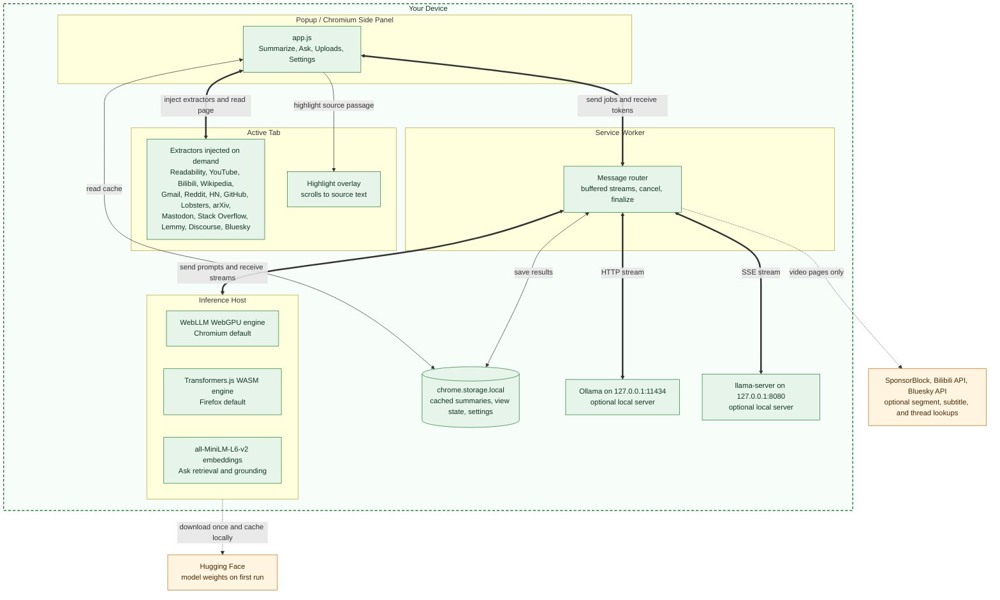
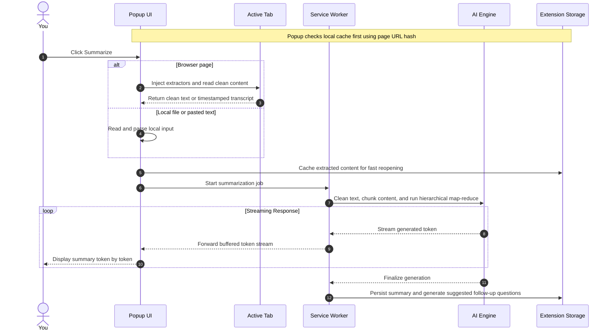

# Apogee Architecture

Apogee is an offline-first browser extension built for full data privacy. All text analysis, summarization, and question answering runs on your own machine. It uses in-browser AI engines or a local Ollama server.

## Overview

Apogee uses four cooperating execution contexts. They talk to each other with standard WebExtension messaging.

- **Popup / Side Panel UI**: The same interface runs in the short-lived toolbar popup or, on Chromium, a persistent side panel. Use it to start summaries, pick output formats, ask follow-up questions, and search past summaries.

- **Service Worker**: The central router. It coordinates tasks, buffers streaming tokens, manages background alarms, and saves results to local storage.

- **Inference Host**: The place where AI models run. On Chromium browsers, this is a dedicated offscreen document with WebGPU and WebAssembly support. On Firefox, models run inside the background page.

- **Content Extractors**: The extension injects focused scripts into active tabs. They clean page content, parse transcripts, handle structured data, or read PDF documents. Popup-side extractors also parse dropped PDF and DOCX files without a tab.

## How It Works

Apogee runs compact language models straight in your browser. On Chrome, Edge, and other Chromium browsers it defaults to WebLLM. WebLLM runs models on your GPU through WebGPU.

On Firefox, which has no WebGPU offscreen support, it defaults to Transformers.js instead. Transformers.js runs smaller ONNX models on your CPU through WebAssembly. It works well on a modern CPU.

Settings on Chrome and Edge also offers Transformers.js as an opt-in choice. It suits machines without WebGPU or users wanting a lighter option.

The first use downloads the model weights (about 270 MB to 2.2 GB based on the model). It caches them locally. After that, all runs work offline.

Prefer larger models, or already run `llama.cpp` yourself? Switch to Local llama.cpp mode and the extension talks to your own `llama-server` over 127.0.0.1. It reads the context window the server reports instead of guessing one from the model name. See the [Local llama.cpp Guide](LLAMACPP.md).

Prefer larger models? Switch to Local Ollama mode. The extension talks straight to your own Ollama instance over 127.0.0.1. It needs no extra backend to install or run.

Ask goes further than the summary itself. It never cuts long pages down to the first few thousand characters. Apogee embeds the page locally (a small on-device model, same trust level as the LLM weights above). It answers using only the passages most relevant to your question.

So questions about details buried deep in a long article, PDF, or video transcript still work. They work beyond what fits in the opening slice. (Retrieval currently runs on Chromium browsers. Firefox falls back to the plain truncated slice for now.)

Pasted text and local files use the same summarization path as a page, but they need no tab URL. Bundled `pdf.js` pulls out PDF text. The popup pulls DOCX text offline from the document ZIP/XML structure. Local inputs get a content-derived cache identity instead of a made-up web origin.

Highlight-in-page checks the summary against the source. Click any bullet (or line, in Sentences/Paragraphs mode). Apogee finds the passage of the original page it most likely came from. It uses the same on-device retrieval Ask uses.

Then it scrolls to the passage and highlights it in the live page. It helps you spot-check a claim without re-reading the whole article. Chromium-only for now, same limit as Ask retrieval above.

Videos (YouTube and Bilibili) get their own path. Apogee pulls the timestamped transcript of the video. It makes a short written gist plus a "Key moments" timeline. The timeline sizes to the video length.

Each entry is a clickable link that jumps the video to that moment. When a video description defines real chapters, the summary follows those chapters instead. Apogee strips sponsor reads and self-promotion from YouTube transcripts first (see the SponsorBlock lookup in PRIVACY.md).

Social threads get dedicated extractors, so long discussions survive Readability. Reddit, Hacker News, Lobsters, Bluesky, and Mastodon parse titles, authors, scores, and reply trees into Markdown. Lemmy, Discourse, Stack Overflow, and GitHub do the same.

Bluesky (`bsky.app`) starts with the public AT Protocol endpoint (no auth, fully nested thread). The endpoint address is `https://public.api.bsky.app/xrpc/app.bsky.feed.getPostThread`. It falls back to DOM parsing when offline. The fallback caps at 80 posts and depth 8.

Wikipedia gets a dedicated extractor, because its articles are long in a specific way. On the World War II article the generic path pulled 169,014 characters. Of those, 76,568 (45%) were See also, Notes, References, Further reading and External links. So nearly half the model passes went to citation lists.

The extractor cuts all text from the first appendix heading. It drops navboxes, infoboxes and the 506 inline citation markers. It re-emits the real section headings. Long articles split on their own limits instead of at blind character offsets.

Same article, 85,659 characters in 17 chunks instead of 30. No network call happens. The page is already open in your tab.

Custom instructions (Settings) let you add your own standing guidance. Examples: "Explain like I'm five", "Focus on the technical details", or "Answer in a formal tone". Apogee applies them on top of its built-in prompt for each summary and answer. They sit under the grounding rules (a page cannot use them to make the model invent things).

A 2000-character cap applies. Leave the box blank to use the defaults unchanged.

## System Components and Trust Boundaries

The diagram below shows how parts interact on your local device and marks the only outside links Apogee ever makes.

## Summarization Sequence

When you ask for a summary, content moves through extraction, chunking, hierarchical map-reduce summarization, and token streaming. Short inputs run a single prompt. Long inputs past the model `getMaxChunks` budget (4 for Transformers.js, 12 for Ollama) map per chunk. The pipeline tree-folds them in groups of `fanIn` until fewer than `maxChunks` intermediates remain. Then a final reduce streams the result.

Each chunk gets coverage. Overflow no longer drops text through stratified sampling. OOM mid-reduce falls back to the joined partials, so you still get coverage.

## Retrieval and Question Answering Flow

The Ask feature lets you query long documents, PDFs, and video transcripts without losing context through heavy truncation.

1. **Chunking**: The pipeline splits the pulled text into overlapping semantic passages.

2. **On-Device Embedding**: The `all-MiniLM-L6-v2` model inside the local inference host embeds each passage.

3. **Similarity Search**: Cosine similarity matches your question against all passage vectors to find the most relevant parts.

4. **Grounded Prompting**: Only the most relevant passages go to the language model, keeping answers correct and tied to the source text.

## Sentence Grounding and Highlighting Flow

When you click a summary bullet in Chromium browsers, Apogee highlights the exact sentence in the live page.

1. **Vector Lookup**: The host embeds the picked bullet text and compares it against the indexed passages of the original article.
2. **Passage Matching**: The pipeline finds the closest passage and sentence offsets.
3. **DOM Scroll and Highlight**: The extension scrolls the page to the match and highlights the source passage with an interactive overlay.

## Browser Environment Differences

- **Chromium Browsers**: Use Manifest V3 offscreen documents (`chrome.offscreen`) to host WebLLM with full WebGPU hardware acceleration.

- **Firefox**: Firefox extension APIs do not support offscreen documents now. Transformers.js runs straight in the Firefox background page with WebAssembly.

- **Local llama.cpp**: It talks over local loopback (`http://127.0.0.1:8080`) from the background service worker. It uses the `llama-server` OpenAI-compatible `/v1/chat/completions` endpoint with SSE framing. Works on each build, since it needs neither WebGPU nor an offscreen document.

- **Local Ollama**: Talks straight over local loopback (`http://127.0.0.1:11434`) with HTTP streaming from the background service worker.

- **Automation & Testing**: For E2E browser automation setup with Playwright or Puppeteer and Apogee loaded, see [DEVELOPMENT.md#browser-automation--e2e-testing](DEVELOPMENT.md#browser-automation--e2e-testing).

## Security Architecture and Isolation Boundaries

- **Zero-Trust Message Validation**: All internal WebExtension message routing checks sender id, rejects tab-originated messages and ports, and enforces per-action rules. Malicious web pages and untrusted scripts cannot call extension actions.

- **Loopback Origin Handling**: The extension strips the `Origin` header from its own `localhost`/`127.0.0.1` requests (Ollama and llama.cpp). Local servers accept them with no extra setup. Where session-scoped rules exist, the extension sets this at runtime for non-tab requests only. Site pages keep their `Origin` headers. The bundled static `rules/ollama-cors.json` stays as a fallback.

- **SponsorBlock Gating**: The SponsorBlock segment lookup runs only when `useSponsorBlock` is on and the browser grants the optional host permission. With "Stay fully local" on, no lookup request goes out. A local phrase heuristic strips sponsor reads instead.

- **Global Scope Isolation**: Content scripts run cleanly inside isolated JavaScript worlds. They leak no refs onto DOM global scope objects (`window.__apogeeHighlight` and `window.extractPageContent` removed).

- **Extractor Input Sanitization & Payload Validation**: Site-specific extractors (for example, Gmail) clean header text and control characters to block prompt injection. They fence or sanitize titles, URLs, questions, custom instructions, translated text, and YouTube chapter titles before model input. Page-influenced text cannot break out of its own section. YouTube and Bilibili extractors cross-check target URL params (`videoId`, `bvid`, `aid`) against embedded script tag structures (`ytInitialPlayerResponse`, `__INITIAL_STATE__`).

- **PDF Payload Bounds**: The pipeline checks binary PDF payloads handled as base64 in `extract-pdf` for correct string typing. It caps them at 50 MB to stop memory exhaustion attacks.

- **Local File Parsing**: Extension code parses PDF and DOCX files picked or dropped into the popup. It checks DOCX ZIP entries for valid structure. It rejects encrypted archives.

  No document bytes go to a remote service. Picked files cap at 50 MB. Pasted and plain-text input caps at 100,000 characters, with a truncation note.

- **Memory Limits & Out-Of-Memory (OOM) Resilience**: In-browser models catch WebGPU buffer allocation failures and WASM memory limits on their own. They call `resetEngineState` and fall back to bounded `chunkTextOverview` sampling. Runs stay stable under tight memory.

  Long-input map-reduce is also OOM-aware. An `oom_fallback` progress event fires. The tree-reduce stops cleanly. It keeps already-made partials and falls back to joined intermediates. So the final reduce still streams coverage of each chunk.
