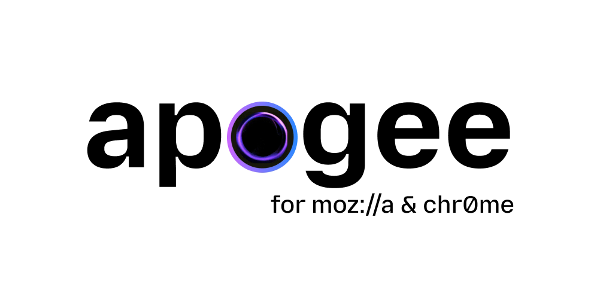

# Apogee

<picture>
  <source
    media="(prefers-color-scheme: dark)"
    srcset="assets/dark_main_logo.png">
  <source
    media="(prefers-color-scheme: light)"
    srcset="assets/light_main_logo.png">
  
</picture>

<div align="center">

Private, in-browser AI summarizer powered by WebGPU and Ollama.

</div>

**Apogee** is an AI browser assistant for articles, videos, emails, and more.
It runs **entirely in your browser** via WebGPU, no backend, no API keys,
no cloud. Just install the extension and go.

For power users, Apogee also supports a local Ollama backend with larger models.

**TL;DR**: Apogee is an offline-first, private AI assistant that runs entirely in your browser using WebGPU, requiring zero cloud dependencies or API keys. It allows users to summarize pages, chat with articles, and process text with complete privacy. For power users, it also features a fallback to local Ollama instances to run larger models. It is designed as a fully local, privacy-respecting alternative to cloud-dependent solutions.

## Inspiration: Orbit (Killed by Mozilla)

Apogee was inspired by Mozilla's discontinued **Orbit** project (read the [Review of Orbit by Mozilla](https://matduggan.com/review-of-orbit-by-mozilla/)). Orbit attempted to provide browser-based page summarization, but it relied on centralized API servers (Mistral 7B) and cached summaries on the server side using endpoints like `store_result`.

Apogee fixes Orbit's architectural and privacy flaws by being fully local-first:
- **Zero Server Overhead**: Instead of routing queries through remote cloud APIs, Apogee performs tokenization and inference completely on-device via WebGPU.
- **No Data Leaks**: Apogee does not send page content or generated summaries to any external endpoint—your data never leaves your machine.
- **Corporate Independence**: Because Apogee has no server dependencies or cloud infrastructure to pay for, it can never be shut down or sunset.

## How It Works

Apogee uses [WebLLM](https://github.com/mlc-ai/web-llm) to run quantized
language models directly in your browser using WebGPU. The first time you use
it, the model weights (~700 MB – 2 GB depending on your choice) are downloaded
and cached locally. After that, everything runs offline.

## Quick Start

1. **Install the extension** (see below).
2. Open any webpage.
3. Click the Apogee icon → **Summarize this page**.
4. On first use, the model downloads automatically. After that it's instant.

That's it. No backend installation, no terminal commands.

### Two Ways to Use Apogee

Apogee offers two modes of operation to balance ease-of-use and raw capabilities:

| WebLLM (In-Browser AI) | Ollama (Local Backend) |
| --- | --- |
| **Model Size**: Small, fast models (~700 MB – 2.2 GB) | **Model Size**: Larger, more capable models (4B–8B+) |
| **Setup**: Zero setup required; automatic download on first run | **Setup**: Requires installing Ollama & Apogee Python backend |
| **Execution**: Runs directly in the browser via WebGPU | **Execution**: Runs locally on your machine via localhost server |
| **Offline**: Fully offline after model weights are cached | **Offline**: Fully offline, communicating over `127.0.0.1` |

## Supported In-Browser Models

| Model                   | Download Size | Best For                   |
| ----------------------- | ------------- | -------------------------- |
| Qwen 2.5 1.5B (default) | ~900 MB       | Multilingual summarization |
| SmolLM2 1.7B            | ~1 GB         | General tasks              |
| Llama 3.2 1B            | ~700 MB       | Lightweight, fast          |
| Phi 3.5 Mini            | ~2.2 GB       | Stronger reasoning         |

## Supported Ollama Models

| Model          | Size    | Command to pull             | Recommended For             |
| -------------- | ------- | --------------------------- | --------------------------- |
| Gemma 3        | ~4B     | `ollama pull gemma3:4b`     | Excellent lightweight tasks |
| Qwen 3 8B      | ~8B     | `ollama pull qwen3:8b`      | Multi-turn chat & reasoning |
| Mistral Latest | ~7B     | `ollama pull mistral:latest` | General language capabilities|
| Llama 3.1 8B   | ~8B     | `ollama pull llama3.1:8b`   | General reasoning & coding  |

## Browser Requirements

- **Chrome 113+** or **Edge 113+** or **Dia** (WebGPU required)
- A GPU with WebGPU support (most modern GPUs)
- Firefox: WebGPU is not yet stable so use **Local Ollama** mode instead

## Install the Extension

### Chrome / Dia

1. Download the packaged extension `.zip` from [Releases](https://github.com/darshi1337/apogee/releases).
2. Extract/unzip the downloaded `.zip` file on your machine.
3. Open the browser and go to `chrome://extensions` or `dia://extensions/`.
4. Enable **Developer mode** (toggle in the top-right).
5. Click **Load unpacked** and select the extracted folder (containing `manifest.json`, not the ZIP file itself).

#### Build from Source (Developer Option)
1. Clone this repository.
2. `cd apogee-extension && npm install && npm run build`
3. Go to `chrome://extensions` or `dia://extensions/` and enable **Developer mode**.
4. Click **Load unpacked** and select the `apogee-extension/dist` folder.

### Firefox

You can install Apogee directly from [Mozilla Add-ons](https://addons.mozilla.org/en-US/firefox/addon/apogeeext/) or download the package from [Releases](https://github.com/darshi1337/apogee/releases).

*Note: WebGPU is not yet stable in Firefox, so switch to **Local Ollama** mode in settings after installation.*

## Advanced: Local Ollama Backend

If you prefer running larger models (8B+) locally through Ollama, Apogee still
supports that as a fallback.

### 1. Install Ollama

Install from https://ollama.com, then:

```bash
ollama pull gemma3:4b   # and qwen3:8b, mistral:latest, llama3.1:8b
```

### 2. Install and Start Apogee Backend

To use the Local Ollama mode, install the Apogee backend package. Download the latest release package distribution file (`apogee_browser-0.1.1-py3-none-any.whl` or `aapogee_browser-0.1.1.tar.gz`) from releases, or clone this repository and install it locally:

```bash
pip install apogee_browser-0.1.1-py3-none-any.whl
apogee setup
apogee doctor
apogee
```

### CLI Commands Reference

The backend CLI provides commands to set up, verify, and run the service:

- **`apogee`**: Starts the local FastAPI backend server on `127.0.0.1:8000` (configurable via `APOGEE_PORT`).
- **`apogee setup`**: Checks if Ollama is installed and automatically pulls the recommended models (`gemma3:4b`, `qwen3:8b`, `mistral:latest`, `llama3.1:8b`).
- **`apogee doctor`**: Runs local diagnostics to verify the Ollama installation, check connection status, and list installed models.

### 4. Switch the Extension

Open the extension → Settings → select **Local Ollama** → set the URL
(defaults to `http://127.0.0.1:8000`).

Update the extension backend URL to match.

## Performance Benchmarks

### In-Browser AI (WebGPU)
- **Generation Throughput**: ~30–50 tokens/s (GPU dependent)
- **Model Cold-load**: ~1–3 seconds (once cached in browser storage)
- **First-run Cache Download**: ~1–3 minutes depending on network bandwidth (to download the ~700 MB – 2.2 GB model weights)

### Local Ollama Backend
Measured locally on an Apple M2 (`gemma3:4b`, GPU via Metal):

| Metric                              | Value                              |
| ----------------------------------- | ---------------------------------- |
| Generation throughput               | ~73 tokens/s                       |
| Model cold-load                     | ~0.25 s                            |
| Short page / question               | ~1–1.5 s end to end                |
| Long page (~40k chars, multi-chunk) | first bullets in ~2 s, ~12 s total |

## Privacy & Permissions

Privacy is the core pillar of Apogee. The following concrete measures are taken to guarantee your data remains entirely yours:

- **Offline-First & Zero Cloud Latency**: 
  - **In-Browser mode**: Every single operation (tokenization, inference, processing) happens on your local device's GPU. No external network requests are made.
  - **Local Ollama mode**: Data travels exclusively over a local loopback (`127.0.0.1`) to your locally running Ollama service.
- **No Telemetry, Tracking, or Analytics**: Apogee does not include Google Analytics, Mixpanel, crash-reporting SDKs, or any other forms of telemetry. No usage data or page contents are ever collected or stored outside your device.
- **Browser Permission Sandboxing**:
  - **`activeTab` + `scripting`**: Apogee cannot read your browsing history or inspect other open tabs. It gains access to the *currently active tab* only when you click the action buttons ("Summarize" or "Ask").
  - **`storage`**: Used strictly to store your preferences (such as selected theme, AI provider, and response format) and cached summaries on your local machine.
- **Secure Local Storage**: Cached model weights are stored in standard browser cache structures locally and never transmitted.

## Development

```bash
cd apogee-extension
npm install
npm run dev    # watch mode — rebuilds on changes
```

Load the `dist/` folder as an unpacked extension in your browser.