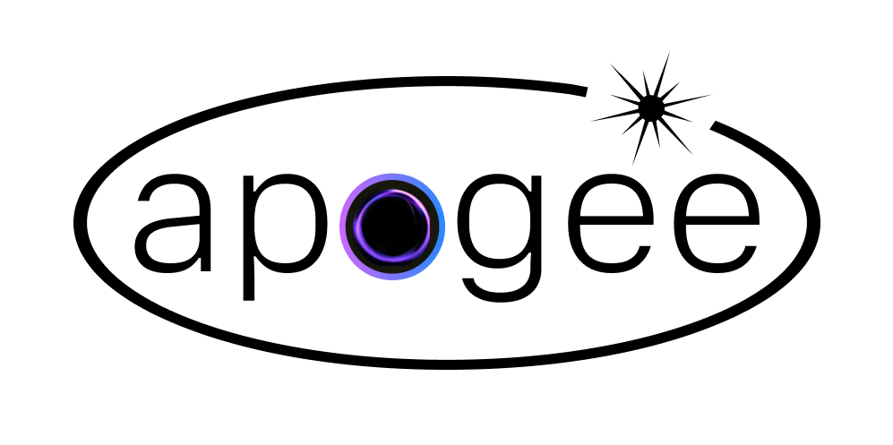

# Apogee

<picture>
  <source
    media="(prefers-color-scheme: dark)"
    srcset=".github/assets/dark_main_logo.png">
  <source
    media="(prefers-color-scheme: light)"
    srcset=".github/assets/light_main_logo.png">
  
</picture>

<div align="center">

Private, in-browser AI summarizer powered by WebGPU and Ollama.

[](https://github.com/darshi1337/apogee/actions/workflows/ci.yml)
[](LICENSE)

</div>

**Apogee** is an AI browser assistant for articles, videos, emails, and more.
It runs **entirely in your browser** via WebGPU, no backend, no API keys,
no cloud. Just install the extension and go.

For power users, Apogee also connects directly to a local Ollama instance to run larger models.

**TL;DR**: Apogee is an offline-first, private AI assistant that runs entirely in your browser using WebGPU, requiring zero cloud dependencies or API keys. It allows users to summarize pages, chat with articles, and process text with complete privacy. For power users, it also features a fallback to local Ollama instances to run larger models. It is designed as a fully local, privacy-respecting alternative to cloud-dependent solutions.

## Inspiration: Orbit (Killed by Mozilla)

Apogee was inspired by Mozilla's discontinued **Orbit** project (read the [Review of Orbit by Mozilla](https://matduggan.com/review-of-orbit-by-mozilla/)). Orbit attempted to provide browser-based page summarization, but it relied on centralized API servers (Mistral 7B) and cached summaries on the server side using endpoints like `store_result`.

Apogee fixes Orbit's architectural and privacy flaws by being fully local-first:

- **Zero Server Overhead**: Instead of routing queries through remote cloud APIs, Apogee performs tokenization and inference completely on-device via WebGPU.
- **No Data Leaks**: Apogee does not send page content or generated summaries to any external endpoint, your data never leaves your machine.
- **Corporate Independence**: Because Apogee has no server dependencies or cloud infrastructure to pay for, it can never be shut down or sunset.

## How It Works

Apogee uses [WebLLM](https://github.com/mlc-ai/web-llm) to run quantized
language models directly in your browser using WebGPU. The first time you use
it, the model weights (~700 MB – 2 GB depending on your choice) are downloaded
and cached locally. After that, everything runs offline.

**Ask** goes further than the summary itself: instead of blindly truncating
long pages to the first few thousand characters, Apogee embeds the page
locally (a small on-device model, same trust tier as the LLM weights above)
and answers using only the passages most relevant to your question. This
means asking about something buried deep in a long article, PDF, or video
transcript still works, not just what fit in the opening truncated slice.

## Quick Start

1. **Install the extension** (see below).
2. Open any webpage.
3. Click the Apogee icon, then **Summarize this page**.
4. On first use, the model downloads automatically. After that it's instant.

That's it. No backend installation, no terminal commands.

### Two Ways to Use Apogee

Apogee offers two modes of operation to balance ease-of-use and raw capabilities:

| In-Browser AI (WebLLM on Chrome/Edge, Transformers.js on Firefox) | Local Ollama                                                     |
| --------------------------------------------------------------- | ---------------------------------------------------------------- |
| **Model Size**: Small, fast models (~270 MB – 2.2 GB)           | **Model Size**: Larger, more capable models (4B–8B+)             |
| **Setup**: Zero setup required; automatic download on first run | **Setup**: Requires installing Ollama (no separate backend to run) |
| **Execution**: Runs directly in the browser, via WebGPU (WebLLM) or WebAssembly (Transformers.js) | **Execution**: Extension talks directly to Ollama's HTTP API     |
| **Offline**: Fully offline after model weights are cached       | **Offline**: Fully offline, communicating over `127.0.0.1`       |

## Supported In-Browser Models

### WebLLM (WebGPU, Chrome/Edge)

| Model                   | Download Size | Best For                   |
| ----------------------- | ------------- | -------------------------- |
| Qwen 2.5 1.5B (default) | ~900 MB       | Multilingual summarization |
| SmolLM2 1.7B            | ~1 GB         | General tasks              |
| Llama 3.2 1B            | ~700 MB       | Lightweight, fast          |
| Phi 3.5 Mini            | ~2.2 GB       | Stronger reasoning         |

### Transformers.js (WASM/CPU, Firefox only)

| Model                    | Download Size | Best For                          |
| ------------------------ | -------------- | ---------------------------------- |
| SmolLM2 360M (default)   | ~270 MB        | Smallest/fastest, quick summaries |
| Qwen 2.5 0.5B            | ~480 MB        | Multilingual                      |
| Llama 3.2 1B             | ~1.2 GB        | Stronger reasoning, slower on CPU |

Runs via [Transformers.js](https://github.com/huggingface/transformers.js)
(ONNX models on the WASM backend). Chosen specifically because it never
spawns a Worker (onnxruntime-web's proxy mode is hardcoded off), unlike
WebGPU-based WebLLM (needs an offscreen document Firefox doesn't have) or
wllama (needs a `blob:`-URL Worker, which both Chrome's and Firefox's
extension CSP block). Generation is single-threaded (extension pages aren't
cross-origin-isolated, so no `SharedArrayBuffer`) and context is capped at
4096 tokens to keep latency reasonable on CPU. On a modern/fast CPU this
still summarizes well with the default SmolLM2 360M model; on older or
low-power hardware, expect noticeably slower generation, and consider
switching to **Local Ollama** instead.

## Supported Ollama Models

Any model you've pulled shows up automatically in the extension's settings
(see [Advanced: Local Ollama Mode](#advanced-local-ollama-mode)). These are
just a starting point if you haven't pulled anything yet:

| Model          | Size | Command to pull              | Recommended For               |
| -------------- | ---- | ---------------------------- | ----------------------------- |
| Gemma 3        | ~4B  | `ollama pull gemma3:4b`      | Excellent lightweight tasks   |
| Qwen 3 8B      | ~8B  | `ollama pull qwen3:8b`       | Multi-turn chat & reasoning   |
| Mistral Latest | ~7B  | `ollama pull mistral:latest` | General language capabilities |
| Llama 3.1 8B   | ~8B  | `ollama pull llama3.1:8b`    | General reasoning & coding    |

Summarization also adapts its chunking to the model you pick: larger-context
models (e.g. `llama3.1`, `qwen2.5`, `gemma3`) get bigger chunks and fewer
passes over long content, rather than the same fixed chunk size regardless
of what the model can actually handle.

## Browser Support

Apogee ships two builds: a Chromium build (`dist/chrome`, Manifest V3 with an
offscreen document for WebGPU) and a Firefox build (`dist/firefox`, no
offscreen document). Anything Chromium-based accepts the same build.

| Browser              | WebLLM (In-Browser AI, WebGPU)    | Transformers.js (In-Browser AI, WASM) | Local Ollama | Notes                                                          |
| --------------------- | -------------------------------- | --------------------------------------- | ------------ | --------------------------------------------------------------- |
| Chrome 113+           | Yes                               | No                                       | Yes          | Primary target, most tested                                    |
| Edge 113+             | Yes                               | No                                       | Yes          | Chromium-based, same engine as Chrome                          |
| Dia                   | Yes                               | No                                       | Yes          | Chromium-based                                                  |
| Brave                 | Should work                       | No                                       | Yes          | Chromium-based; WebGPU may need enabling in `brave://flags`, not independently verified |
| Opera / Opera GX      | Should work                       | No                                       | Yes          | Chromium-based, not independently verified                      |
| Vivaldi               | Should work                       | No                                       | Yes          | Chromium-based, not independently verified                      |
| Arc                   | Should work                       | No                                       | Yes          | Chromium-based, not independently verified                      |
| Firefox               | No                                | Yes (default)                           | Yes          | Firefox's WebExtensions implementation has no `browser.offscreen` API, which WebLLM needs to run WebGPU outside a visible tab (a service worker can't access WebGPU directly). Transformers.js needs neither WebGPU nor a Worker, so it runs directly in Firefox's background page instead, and is the default in-browser provider there. |
| Safari                | No                                | No           | Apogee doesn't currently build or ship a Safari extension (a separate packaging toolchain from Chrome/Firefox); not evaluated regardless of Safari's own WebGPU support |

See MDN's [WebGPU API browser compatibility table](https://developer.mozilla.org/en-US/docs/Web/API/WebGPU_API#browser_compatibility)
for exact per-browser/per-OS WebGPU version support, it's a fast-moving target
and a better source of truth than a number hardcoded here. A GPU with WebGPU
support (most GPUs from the last several years) is required for the
In-Browser (WebLLM) mode specifically. Local Ollama mode has no GPU
requirement of its own beyond whatever Ollama itself needs.

## Install the Extension

### Chrome, Edge, Brave, Opera, Vivaldi, Arc, Dia

These are all Chromium-based and use the same `dist/chrome` build and load
steps; only the extensions-page URL differs slightly (`chrome://extensions`,
`edge://extensions`, `brave://extensions`, `dia://extensions/`, etc.).

1. Download the packaged extension `.zip` from [Releases](https://github.com/darshi1337/apogee/releases).
2. Extract/unzip the downloaded `.zip` file on your machine.
3. Open your browser's extensions page (`chrome://extensions` on Chrome/Brave/Opera/Vivaldi, `edge://extensions` on Edge, `dia://extensions/` on Dia).
4. Enable **Developer mode** (toggle in the top-right).
5. Click **Load unpacked** and select the extracted folder (containing `manifest.json`, not the ZIP file itself).

#### Build from Source (Developer Option)

1. Clone this repository.
2. `cd apogee-extension && npm install && npm run build`
3. Go to your browser's extensions page and enable **Developer mode**.
4. Click **Load unpacked** and select the `apogee-extension/dist/chrome` folder.

   > `npm run build` produces both `dist/chrome` and `dist/firefox`. Use `dist/chrome` for any Chromium-based browser and `dist/firefox` for Firefox. You can also build a single target with `npm run build:chrome` or `npm run build:firefox`.

### Firefox

You can install Apogee directly from [Mozilla Add-ons](https://addons.mozilla.org/en-US/firefox/addon/apogeeext/) or download the package from [Releases](https://github.com/darshi1337/apogee/releases).

_Note: WebGPU is not yet stable in Firefox, so switch to **Local Ollama** mode in settings after installation._

## Advanced: Local Ollama Mode

If you prefer running larger models (8B+) locally through Ollama, Apogee talks
to it **directly over HTTP** — there's no separate backend server to install
or keep running.

### 1. Install Ollama

Install from https://ollama.com, then pull the models you want:

```bash
ollama pull gemma3:4b   # and qwen3:8b, mistral:latest, llama3.1:8b
```

### 2. Allow the extension to reach Ollama (CORS)

Ollama only accepts browser-originated requests from an allow-listed set of
origins, and `chrome-extension://` isn't in that default list. Set
`OLLAMA_ORIGINS` before starting Ollama:

```bash
OLLAMA_ORIGINS="chrome-extension://<your-extension-id>" ollama serve
```

Find `<your-extension-id>` on `chrome://extensions` (with Developer mode on).

If Ollama runs as a system service instead (e.g. installed via a package
manager on Linux), set it as a persistent override rather than passing it on
the command line:

```bash
sudo mkdir -p /etc/systemd/system/ollama.service.d
printf '[Service]\nEnvironment="OLLAMA_ORIGINS=chrome-extension://<your-extension-id>"\n' \
  | sudo tee /etc/systemd/system/ollama.service.d/override.conf
sudo systemctl daemon-reload
sudo systemctl restart ollama
```

> **Security note**: `OLLAMA_ORIGINS=chrome-extension://*` (allowing *every*
> extension) is convenient while developing, but it means any other extension
> installed in your browser could also reach your local Ollama instance's
> API. Scope it to your specific extension ID for anything beyond quick
> local testing.

### 3. Point the extension at Ollama

Open the extension, go to Settings, and select **Local Ollama**. The host
field defaults to `http://127.0.0.1:11434` (Ollama's own default port) —
only change it if you've configured Ollama to listen elsewhere.

Once connected, the model list is populated live from whatever you've
actually pulled (via Ollama's own `/api/tags`), not a fixed list, so any
model you `ollama pull` shows up automatically. If Ollama isn't reachable
yet, a small default list is shown instead so you can still pick a model
before starting it.

That's it — no `apogee-backend`, no separate server process to manage.

## Performance Benchmarks

### In-Browser AI (WebGPU)

- **Generation Throughput**: ~30–50 tokens/s (GPU dependent)
- **Model Cold-load**: ~1–3 seconds (once cached in browser storage)
- **First-run Cache Download**: ~1–3 minutes depending on network bandwidth (to download the ~700 MB – 2.2 GB model weights)

### Local Ollama

Measured locally on an Apple M2 (`gemma3:4b`, GPU via Metal):

| Metric                              | Value                              |
| ----------------------------------- | ---------------------------------- |
| Generation throughput               | ~73 tokens/s                       |
| Model cold-load                     | ~0.25 s                            |
| Short page / question               | ~1–1.5 s end to end                |
| Long page (~40k chars, multi-chunk) | first bullets in ~2 s, ~12 s total |

## Privacy & Permissions

Privacy is the core pillar of Apogee. The key guarantee is simple: **your page content and the summaries/answers generated from it are never sent to any cloud service or third party.** Inference happens on your own device (WebGPU) or your own machine (`127.0.0.1` Ollama). The details below are precise about the few network requests that do occur and what is kept on disk.

- **Where inference happens**:
  - **In-Browser mode**: Tokenization and inference run entirely on your local device — on the GPU via WebGPU (WebLLM, Chrome/Edge) or on the CPU via WebAssembly (Transformers.js, Firefox). Your page content and summaries are never transmitted anywhere.
  - **Local Ollama mode**: Page content travels exclusively over local loopback (`127.0.0.1`) directly to your own Ollama instance's HTTP API, never to the cloud. There is no intermediate backend process in the path, the extension is Ollama's only client-side hop.
- **The only outbound network requests Apogee makes**:
  - **Model weights** are downloaded once from **Hugging Face** (in-browser mode) or pulled by **Ollama** (local mode), then cached and reused offline. This transfers no page content, only the model files themselves.
  - **WebLLM runtime files**: in-browser mode also fetches the WebLLM library's own config/wasm assets from `raw.githubusercontent.com`, the same as the model weights above, no page content, just the runtime itself.
  - **In-browser WASM runtime**: Ask's local embedding model, and Firefox's Transformers.js summarization engine, load their shared ONNX WASM runtime once from `cdn.jsdelivr.net` (model weights come from Hugging Face, same as above), again the runtime only, never page content.
  - **YouTube transcripts**: on a YouTube page, the extractor fetches that video's caption track from YouTube/Google (the site you're already on) to feed the transcript to the model. It is restricted to genuine `youtube.com`/`google.com`/`googlevideo.com` hosts.
  - **YouTube sponsor-segment lookup (SponsorBlock)**: when summarizing a YouTube video, Apogee asks the crowdsourced [SponsorBlock](https://sponsor.ajay.app) API which parts of the video are sponsor reads/self-promo, so they can be stripped from the transcript. This uses SponsorBlock's privacy-preserving k-anonymity endpoint: only the first 4 hex characters of the SHA-256 hash of the video ID are sent — never the video ID, URL, or any page content — and the matching entry is picked out locally. If the lookup fails, a local phrase heuristic runs instead, with no network call at all.
  - That's it, there are no other external calls. (See the extension's `content_security_policy.connect-src` in `manifest.json` for the exact allow-list this is enforced against, and `ALLOWED_OLLAMA_HOSTS` in `background/service-worker.js`, which rejects any Local Ollama host setting that isn't `127.0.0.1`/`localhost`/`[::1]`.)
- **PDFs**: PDF text extraction runs fully client-side using `pdf.js` bundled into the extension, the PDF is downloaded straight into the browser tab (using that tab's own network context) and parsed there. Only the extracted text is ever handed to the model; the file itself never passes through any other process.
- **Local Ollama's CORS setting (`OLLAMA_ORIGINS`)**: for the extension to reach Ollama at all, Ollama must be told to accept requests from the extension's origin, see [Advanced: Local Ollama Mode](#advanced-local-ollama-mode). This is a browser-enforced allow-list, not a data-transmission path, but be aware that setting it to a wildcard (`chrome-extension://*`) rather than your specific extension ID lets *any* installed extension talk to your local Ollama API, not just Apogee. Ollama itself still only binds to `127.0.0.1` by default regardless of this setting, so it's never reachable from your network either way, this only affects which browser extensions can call it.
- **No Telemetry, Tracking, or Analytics**: Apogee includes no Google Analytics, Mixpanel, crash-reporting SDKs, or telemetry of any kind. No usage data is collected.
- **What's stored on your device (and how to control it)**:
  - To make reopening the popup instant, Apogee caches **summaries, suggested prompts, extracted page text (for articles), and your recent questions/answers** in local extension storage (`chrome.storage.local`), never transmitted, capped in size, and keyed by a hash of the URL (so URLs with tokens aren't stored in plaintext keys).
  - **Sensitive sites are never cached**, pages on known webmail/messaging hosts (Gmail, Outlook, Proton Mail, Yahoo Mail, Google Messages, WhatsApp Web) are always treated as ephemeral, regardless of your setting.
  - Under **Settings, Privacy**, you can switch to **"Don't save (this session only)"** so nothing page-derived is written to disk, and **"Clear cached summaries & page data"** wipes all cached content on demand (your preferences are kept).
- **Browser Permission Sandboxing**:
  - **`activeTab` + `scripting`**: Apogee cannot read your browsing history or inspect other open tabs. It reads the _currently active tab_ only when you click "Summarize" or "Ask".
  - **`storage`**: Holds your preferences plus the local cache described above.
  - **`unlimitedStorage`**: Lifts the default quota on `chrome.storage.local` so the cached summaries/page text above aren't evicted under normal storage pressure, it does not grant access to anything beyond that cache.
  - **`offscreen`** (Chrome/Edge only): Runs the in-browser WebLLM engine in a hidden document, since a service worker can't access WebGPU directly. Not used, and not requested, in the Firefox build.
  - **`alarms`**: Schedules the housekeeping timers that close the idle in-browser model and clean up finished request buffers, these need to survive the extension's background worker being suspended between uses. No user data is involved.
- **Model weights** are stored in standard browser cache structures locally and never transmitted.

## Development

```bash
cd apogee-extension
npm install
npm run dev    # watch mode, rebuilds on changes
```

Load the `dist/chrome` folder (or `dist/firefox`) as an unpacked extension in your browser.

Before opening a PR, see [CONTRIBUTING.md](CONTRIBUTING.md) for the lint/format/test/build checks CI runs.

## Changelog

See [CHANGELOG.md](CHANGELOG.md) for release notes.

## License

[MIT](LICENSE)
