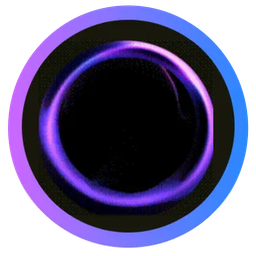
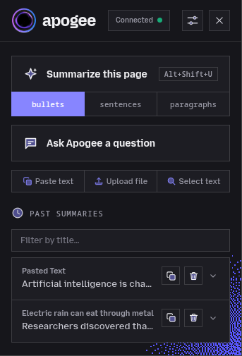
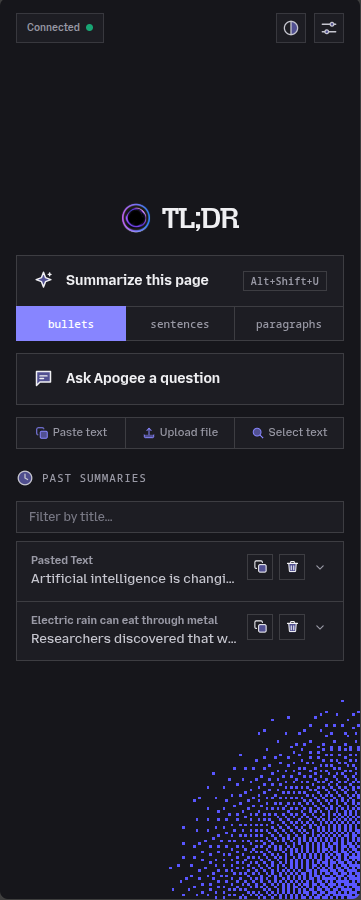

# Apogee

A private, in-browser AI summarizer for your articles, videos, PDFs, DOCX files, and pasted text. Runs on WebGPU, WebAssembly, or your own local Ollama or llama.cpp server.

 &nbsp; 

<a href="https://darshi1337.github.io/apogee/">Website</a> | <a href="ARCHITECTURE.md">Architecture</a> | <a href="MODELS.md">Models</a> | <a href="BROWSERS.md">Browsers</a> | <a href="PRIVACY.md">Privacy</a> | <a href="ROADMAP.md">Roadmap</a> | <a href="STORE-LISTING.md">Store listing</a> | <a href="LICENSE">License</a>

An offline-first, privacy-respecting browser extension built with care by <a href="https://github.com/darshi1337">darshi1337</a> and <a href="https://github.com/darshi1337/apogee/graphs/contributors">contributors</a>

> **For AI Assistants and LLMs**: Read [llms.txt](llms.txt) for codebase structure, build scripts, test commands, and developer instructions.

Apogee is an AI browser assistant for articles, videos, emails, and more. It runs entirely in your browser: on your GPU via WebGPU (Chrome, Edge, and other Chromium browsers) or on your CPU via WebAssembly, which now works everywhere. WebAssembly is the default on Firefox and an opt-in fallback on Chromium browsers, useful on machines without WebGPU. No backend, no API keys, no cloud. Just install the extension and go.

For power users, Apogee also connects directly to a local Ollama instance over `127.0.0.1` or to a `llama-server` you run yourself.

> **In short:** Apogee summarizes pages, videos, PDFs, DOCX files, and pasted text locally. No account, API key, backend, or cloud upload is required.

⭐ If Apogee is useful to you, consider [starring the repository](https://github.com/darshi1337/apogee). It helps the project reach more contributors.

## Get Started

1. Install Apogee from the [Chrome Web Store](https://chromewebstore.google.com/detail/apogee/pgemlpomhkdcjjjcpnjlebalnfglomog) or [Firefox Add-ons](https://addons.mozilla.org/en-US/firefox/addon/apogeeext/).
2. Open a page, video, PDF, or DOCX file, or paste text into the Apogee popup.
3. Choose a summary format and select **Summarize**.

The first in-browser run downloads the selected model. After the model is cached, summaries run offline. For larger models, configure [Ollama](OLLAMA.md) or [llama.cpp](LLAMACPP.md) in Settings.

## Why Apogee

Apogee was inspired by Mozilla's discontinued Orbit project (read the [Review of Orbit by Mozilla](https://discourse.mozilla.org/t/review-of-orbit-by-mozilla/130283)). Orbit attempted to provide browser-based page summarization, but relied on centralized API servers and server-side summary caching.

Apogee fixes Orbit's architectural and privacy flaws by being fully local-first:

- **Local by default**: Tokenization, inference, retrieval, and caching happen on your device.
- **Private by design**: Page content, transcripts, files, and summaries are not sent to cloud APIs.
- **No account required**: There is no subscription, API key, telemetry service, or Apogee backend.

## At A Glance

The table below compares Apogee with typical cloud-based AI extensions and Mozilla's discontinued Orbit project.

| Feature or Architecture | Apogee | Cloud AI Extensions | Mozilla Orbit Project |
| :-- | :-- | :-- | :-- |
| Local On-Device Inference | Yes (WebGPU, WASM, Ollama, and llama.cpp) | No (Requires cloud API endpoints) | No (Relied on remote Mistral 7B servers) |
| Zero API Key Requirement | Yes (No keys, subscriptions, or accounts) | No (Requires API keys or paid tiers) | Yes |
| Offline Functionality | Yes (Works offline after initial weight cache) | No (Requires active internet connection) | No (Failed without server connection) |
| Zero Data Transmission | Yes (Page contents never leave your device) | No (Full webpage text uploaded to servers) | No (Page summaries cached on remote server) |
| Open Source License | Yes (MIT License) | Varies | Yes |
| Local Ollama Integration | Yes (Direct loopback HTTP connection) | Rare | No |
| Local llama.cpp Integration | Yes (Direct loopback HTTP connection to `llama-server`) | Rare | No |
| Grounded Passage Highlighting | Yes (Interactive source sentence scroll) | Rare | No |

## What It Can Do

- **Articles and Web Pages**: Clean extraction of text using Readability and specialized site extractors for Wikipedia, GitHub, Reddit, Hacker News, Bluesky, Mastodon, Lemmy, Discourse, Stack Overflow, Lobsters, and arXiv.
- **Selected Text**: Select at least 20 characters on a supported webpage and use **Selection** in the popup or the browser context menu to summarize only that text. Follow-up Ask questions keep the selected text as their source context.
- **YouTube and Bilibili Videos**: Interactive timestamped timelines allowing you to click key moments to seek video playback directly.
- **Social Threads**: Bluesky, Reddit, Hacker News, Mastodon, Lemmy, Discourse, and other discussion platforms are parsed into structured Markdown preserving author, score, and reply hierarchy.
- **Local documents and text**: Select or drag PDF, DOCX, TXT, Markdown, JSON, or HTML files into the popup, or paste text directly.
- **Ask Q&A with Smart Retrieval**: Embedded passages are matched locally so you can ask questions about long documents without losing context.
- **Grounding and Sentence Highlighting**: Click any summary bullet to scroll the webpage directly to the original source passage on Chromium browsers.
- **Persistent Chrome Side Panel**: Keep the summary or Ask flow visible beside the page while browsing.
- **Light and dark themes**: Switch themes from the home and summary headers.
- **Custom Standing Instructions**: Set personal prompt guidance like simple explanations or technical summaries.
- **Multi-Language Translation**: Summarize pages into 32 supported target languages using the default Helsinki-NLP Opus-MT engine or direct LLM translation.

## Screenshots

<table>
<thead>
<tr>
<th align="center" width="50%">Extension Popup</th>
<th align="center" width="50%">Persistent Side Panel</th>
</tr>
</thead>
<tbody>
<tr>
<td align="center" valign="top">

</td>
<td align="center" valign="top">

</td>
</tr>
</tbody>
</table>

## Privacy

- **Zero Data Leaks**: Page contents, transcripts, PDFs, and summaries are processed locally and never uploaded to cloud APIs.
- **Local Loopback**: Ollama and llama.cpp connections communicate strictly over local loopback (`http://127.0.0.1`); any other host is refused.
- **Anonymized SponsorBlock**: YouTube sponsor lookups send only a k-anonymity hash prefix and can be disabled under Settings > Privacy to stay fully local (no lookup request is made at all).
- **Sensitive Site Exclusions**: Gmail, Outlook, Proton Mail, Yahoo Mail, Google Messages, WhatsApp Web, Telegram Web, Slack, Discord, Microsoft Teams, and custom domain lists are excluded from disk caching.

Read our complete security model in the [Privacy and Security Architecture](PRIVACY.md).

## Documentation Directory

### For Users

- **[Browser Support](BROWSERS.md)**: Browser compatibility matrix, WebGPU vs WebAssembly execution, and Ollama support.
- **[Model Reference](MODELS.md)**: Complete model table, download sizes, context windows, and benchmarks.
- **[Local llama.cpp Guide](LLAMACPP.md)**: Setup guide for connecting Apogee to your own `llama-server` instance.
- **[Local Ollama Guide](OLLAMA.md)**: Setup guide for running local models on macOS, Windows, and Linux.
- **[Translation Reference](TRANSLATION.md)**: Overview of 29 supported target languages and Opus-MT model tiers.
- **[Privacy Architecture](PRIVACY.md)**: Comprehensive explanation of network boundaries, storage, and permissions.
- **[Error Messages Guide](ERROR.md)**: Complete catalog of user-facing messages, cause breakdowns, troubleshooting steps, and diagnostics.

### For Developers & Contributors

- **[Architecture Reference](ARCHITECTURE.md)**: Deep dive into the 4 contexts, How It Works, execution flows, and trust boundaries.
- **[Developer Setup](DEVELOPMENT.md)**: Instructions for building, running watch mode, running test suites, and formatting.
- **[Contributing Guide](CONTRIBUTING.md)**: Guidelines for opening pull requests, submitting code changes, and claiming issues.
- **[Project Roadmap](ROADMAP.md)**: Feature roadmap, planned milestones, and completed releases.
- **[Changelog](CHANGELOG.md)**: Comprehensive release history and detailed version changes.
- **[Security Policy](SECURITY.md)**: Security policy, vulnerability disclosure, and reporting guidelines.
- **[Code of Conduct](CODE_OF_CONDUCT.md)**: Community standards of conduct and guidelines.

## License

[MIT](LICENSE)
