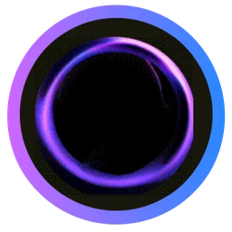
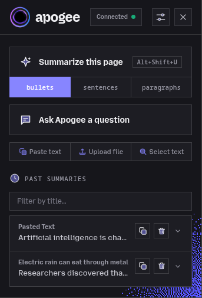
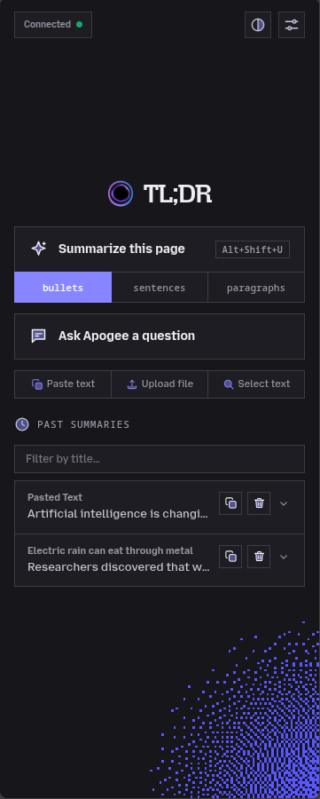

<div align="center">



# Apogee

A private AI summarizer in your browser for articles, videos, PDFs, DOCX files, and pasted text. It runs on WebGPU, WebAssembly, or your own local Ollama or llama.cpp server.

<a href="https://chromewebstore.google.com/detail/apogee/pgemlpomhkdcjjjcpnjlebalnfglomog"></a> &nbsp; <a href="https://addons.mozilla.org/en-US/firefox/addon/apogeeext/"></a>

<a href="https://darshi1337.github.io/apogee/">Website</a> | <a href="ARCHITECTURE.md">Architecture</a> | <a href="MODELS.md">Models</a> | <a href="BROWSERS.md">Browsers</a> | <a href="PRIVACY.md">Privacy</a> | <a href="ROADMAP.md">Roadmap</a> | <a href="STORE-LISTING.md">Store listing</a> | <a href="LICENSE">License</a>

[](https://github.com/darshi1337/apogee/releases) [](LICENSE) [](https://github.com/darshi1337/apogee/actions/workflows/ci.yml) [](https://scorecard.dev/viewer/?uri=github.com/darshi1337/apogee)

[](CONTRIBUTING.md) [](https://github.com/darshi1337/apogee/issues?q=is%3Aissue+is%3Aopen+label%3A%22good+first+issue%22) [](https://github.com/darshi1337/apogee/issues?q=is%3Aissue+is%3Aopen+label%3Afirst-timers-only) [](https://github.com/darshi1337/apogee/issues?q=is%3Aissue+is%3Aopen+label%3A%22help+wanted%22) [](https://github.com/darshi1337/apogee/graphs/contributors)

<sub>An offline-first browser extension that respects privacy, built with care by <a href="https://github.com/darshi1337">darshi1337</a> and <a href="https://github.com/darshi1337/apogee/graphs/contributors">contributors</a></sub>

</div>

> **For AI Assistants and LLMs**: Read [llms.txt](llms.txt) for codebase structure, build scripts, test commands, and developer instructions.

Apogee is an AI browser assistant for articles, videos, emails, and more. It runs fully in your browser. It uses your GPU with WebGPU (Chrome, Edge, and other Chromium browsers). It uses your CPU with WebAssembly, which now works everywhere.

WebAssembly is the default on Firefox and an opt-in fallback on Chromium browsers. It helps on machines without WebGPU. No backend, no API keys, no cloud. Install the extension and start.

For power users, Apogee also talks straight to a local Ollama instance over `127.0.0.1`. It also talks to a `llama-server` you run yourself.

> **In short:** Apogee summarizes pages, videos, PDFs, DOCX files, and pasted text locally. It needs no account, API key, backend, or cloud upload.

⭐ If Apogee helps you, [star the repository](https://github.com/darshi1337/apogee). It helps the project reach more contributors.

## Get Started

1. Install Apogee from the [Chrome Web Store](https://chromewebstore.google.com/detail/apogee/pgemlpomhkdcjjjcpnjlebalnfglomog). Or use [Firefox Add-ons](https://addons.mozilla.org/en-US/firefox/addon/apogeeext/).

2. Open a page, video, PDF, or DOCX file, or paste text into the Apogee popup.

3. Pick a summary format and select **Summarize**.

The first in-browser run downloads the picked model. Cached models run offline after that. For larger models, set up [Ollama](OLLAMA.md) or [llama.cpp](LLAMACPP.md) in Settings.

## Why Apogee

The discontinued Orbit project from Mozilla inspired Apogee. Orbit tried browser-based page summarization, but it used central API servers and stored summaries on servers.

Apogee fixes the design and privacy problems of Orbit by staying local-first:

- **Local by default**: Tokenization, inference, retrieval, and caching happen on your device.

- **Private by design**: Page content, transcripts, files, and summaries never go to cloud APIs.

- **No account needed**: No subscription, API key, telemetry service, or Apogee backend exists.

## At A Glance

The table below compares Apogee with common cloud-based AI extensions and the discontinued Orbit project from Mozilla.

| Feature or Architecture | Apogee | Cloud AI Extensions | Mozilla Orbit Project |
| :-- | :-- | :-- | :-- |
| Local On-Device Inference | Yes (WebGPU, WASM, Ollama, llama.cpp) | No (Needs cloud APIs) | No (Used remote Mistral 7B servers) |
| Zero API Key Requirement | Yes (No keys, subscriptions, or accounts) | No (Needs API keys or paid tiers) | Yes |
| Offline Functionality | Yes (Works offline after initial weight cache) | No (Needs active internet connection) | No (Failed without server connection) |
| Zero Data Transmission | Yes (Stays on your device) | No (Uploads full webpage text) | No (Caches page summaries remotely) |
| Open Source License | Yes (MIT License) | Varies | Yes |
| Local Ollama Integration | Yes (Direct loopback HTTP connection) | Rare | No |
| Local llama.cpp Integration | Yes (Direct loopback HTTP connection to `llama-server`) | Rare | No |
| Grounded Passage Highlighting | Yes (Interactive source sentence scroll) | Rare | No |

## What It Can Do

- **Articles and Web Pages**: Clean text extraction uses Readability and site-specific extractors. They cover Wikipedia, GitHub, Reddit, Hacker News, Bluesky, Mastodon, Lemmy, Discourse, Stack Overflow, Lobsters, and arXiv.

- **Selected Text**: Select at least 20 characters on a supported page. Use **Selection** in the popup or the browser context menu to summarize only that text. Follow-up Ask questions keep the picked text as their source.

- **YouTube and Bilibili Videos**: Interactive timestamped timelines. Click key moments to jump straight to them in the video.

- **Social Threads**: Apogee parses Bluesky, Reddit, Hacker News, Mastodon, Lemmy, Discourse, and other discussion sites into structured Markdown. It keeps author, score, and reply order.

- **Local documents and text**: Pick or drag PDF, DOCX, TXT, Markdown, JSON, or HTML files into the popup, or paste text directly.

- **Ask Q&A with Smart Retrieval**: Apogee matches passages locally. You can ask about long documents without losing context.

- **Grounding and Sentence Highlighting**: Click any summary bullet to scroll the page straight to the source passage on Chromium browsers.

- **Persistent Chrome Side Panel**: Keep the summary or Ask view open next to the page while you browse.

- **Light and dark themes**: Change themes from the home and summary headers.

- **Custom Standing Instructions**: Set your own prompt guidance such as simple explanations or technical summaries.

- **Per-Page Focus Keywords**: Enter an optional topic or keyword (up to 200 characters) in the **Focus on... (optional)** field (located below the response format selector in the home view) before summarizing articles, PDFs, DOCX files, or pasted text to steer emphasis toward specific themes without inventing facts. The input is hidden on video, discussion (Hacker News, Reddit, Stack Overflow), and multi-tab pages.

- **Multi-Language Translation**: Summarize pages into 32 target languages with the default Helsinki-NLP Opus-MT engine or direct LLM translation.

## Screenshots

<table>
<thead>
<tr>
<th align="center" width="50%">Extension Popup</th>
<th align="center" width="50%">Persistent Side Panel</th>
</tr>
</thead>
<tbody>
<tr>
<td align="center" valign="top">

</td>
<td align="center" valign="top">

</td>
</tr>
</tbody>
</table>

## Privacy

- **Zero Data Leaks**: Apogee handles page contents, transcripts, PDFs, and summaries locally. Nothing uploads to cloud APIs.

- **Local Loopback**: Ollama and llama.cpp connections run strictly over local loopback (`http://127.0.0.1`). Apogee refuses any other host.

- **Anonymized SponsorBlock**: YouTube sponsor lookups send only a k-anonymity hash prefix. Turn them off under Settings, then Privacy to stay fully local. Then no lookup request goes out.

- **Sensitive Site Exclusions**: Apogee excludes sensitive sites from disk caching. Covered hosts: Gmail, Outlook, Proton Mail, Yahoo Mail, Google Messages, WhatsApp Web, Telegram Web, Slack, Discord, Microsoft Teams. Custom domain lists join them.

Read the full security model in [Privacy and Security Architecture](PRIVACY.md).

## Documentation Directory

### For Users

- **[Browser Support](BROWSERS.md)**: Browser compatibility table, WebGPU versus WebAssembly execution, and Ollama support.

- **[Model Reference](MODELS.md)**: Full model table, download sizes, context windows, and benchmarks.

- **[Local llama.cpp Guide](LLAMACPP.md)**: Setup steps for linking Apogee to your own `llama-server` instance.

- **[Local Ollama Guide](OLLAMA.md)**: Setup steps for local models on macOS, Windows, and Linux.

- **[Translation Reference](TRANSLATION.md)**: Overview of 29 supported target languages and Opus-MT model tiers.

- **[Privacy Architecture](PRIVACY.md)**: Full details on network limits, storage, and permissions.

- **[Error Messages Guide](ERROR.md)**: Full list of user-facing messages, causes, fixes, and diagnostics.

- **[Troubleshooting](TROUBLESHOOTING.md)**: Fix the common failures by symptom: no WebGPU, stalled model download, Ollama unreachable, slow Firefox, unreadable page.

### For Developers & Contributors

Extractor contributions need no browser, GPU, or model download. The fixture harness runs site extractors against saved HTML in Node.js 22 or newer:

```bash
cd apogee-extension
npm install
npm test
```

See the [extractor test harness and worked examples](apogee-extension/tests/extractors/README.md) to add a fixture. It shows how to test a site-specific extractor. The [contributing guide](CONTRIBUTING.md) lists available issues and the checks to run before a PR.

- **[Architecture Reference](ARCHITECTURE.md)**: Details on the 4 contexts, how it works, execution flows, and trust limits.

- **[Developer Setup](DEVELOPMENT.md)**: Steps to build, run watch mode, run test suites, and format code.

- **[Contributing Guide](CONTRIBUTING.md)**: Rules for opening pull requests, sending code changes, and claiming issues.

- **[Project Roadmap](ROADMAP.md)**: Feature roadmap, planned milestones, and completed releases.

- **[Changelog](CHANGELOG.md)**: Full release history and version changes.

- **[Security Policy](SECURITY.md)**: Security policy, how to disclose flaws, and reporting steps.

- **[Code of Conduct](CODE_OF_CONDUCT.md)**: Community standards and guidelines.

## Contributors

Thanks to all contributors:

<!-- contributors:start -->
<!-- cspell:disable --><!-- contributor usernames are not dictionary words -->
<p>
  <a href="https://github.com/darshi1337"></a> <a href="https://github.com/prashantpiyush1111"></a> <a href="https://github.com/mohdUwaish59"></a> <a href="https://github.com/vaishaldsouza"></a> <a href="https://github.com/chenzeyan54-commits"></a> <a href="https://github.com/Daniele-Cangi"></a> <a href="https://github.com/naba-runn"></a> <a href="https://github.com/rodriveiga01"></a> <a href="https://github.com/bcu001"></a> <a href="https://github.com/PandaHUN777"></a> <a href="https://github.com/MayurK-cmd"></a> <a href="https://github.com/avijit-thawani"></a> <a href="https://github.com/zenithamza"></a> <a href="https://github.com/lb1192176991-lab"></a> <a href="https://github.com/Yuvemil"></a> <a href="https://github.com/tejas5038"></a> <a href="https://github.com/Gambit-Checkmate"></a> <a href="https://github.com/Rutvik552k"></a> <a href="https://github.com/RohitSutar1823"></a> <a href="https://github.com/Jah-yee"></a> <a href="https://github.com/JSP7A"></a> <a href="https://github.com/GhostCoder6969"></a> <a href="https://github.com/DYNOSuprovo"></a> <a href="https://github.com/ayushi-wq"></a> <a href="https://github.com/amoussa1229"></a> <a href="https://github.com/Aarav-cyber"></a>
</p>
<!-- cspell:enable -->
<!-- contributors:end -->

## License

[MIT](LICENSE)
